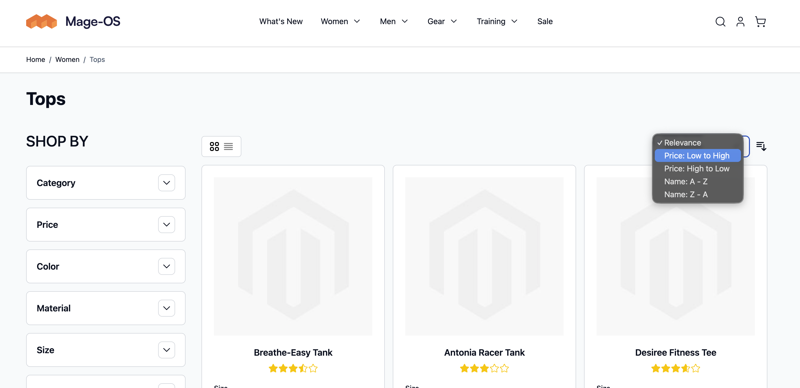
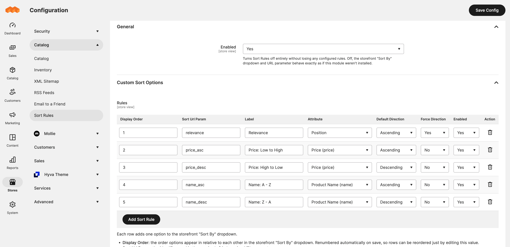

# StackNuts Sort Rules

[](https://packagist.org/packages/stacknuts/magento-sort-rules) [](https://github.com/StackNuts/magento-sort-rules/blob/main/LICENSE) [](https://packagist.org/packages/stacknuts/magento-sort-rules)

Enhance the storefront "Sort By" selector on the catalog listing toolbar. This module lets you define a custom display for your sortable attributes entirely from Stores > Configuration > Catalog > Sort Rules, no template override or custom plugin required.



## Why

Out of the box, Magento's "Sort By" dropdown only offers a shopper "Price" plus a separate direction toggle, not "Price: High to Low" as a single click. This module lets an admin define exactly the sort options a customer sees, each with its own label, attribute, and direction, so a shopper can jump straight to what they want (prices high to low, newest first) in one click instead of two.

## Installation

```bash
composer require stacknuts/magento-sort-rules
bin/magento module:enable StackNuts_SortRules
bin/magento setup:upgrade
```

## Configuration



1. Go to **Stores > Configuration > Catalog > Sort Rules**.
2. Under **General**, **Enabled** turns the module's storefront logic off entirely without losing any configured rules; while off, the "Sort By" dropdown and `product_list_order` URL parameter behave exactly as if this module weren't installed.
3. Under **Custom Sort Options**, add a row per sort option:
   - **Sort Url Param**: the identifier used in the `product_list_order` URL parameter. Doesn't need to match the attribute code, and typically shouldn't when a rule pins a specific direction (e.g. `price_desc`, `newest`). Must be unique among enabled rules; saving two enabled rows with the same value is rejected rather than silently dropping one of them.
   - **Label**: the text shown in the storefront "Sort By" dropdown.
   - **Attribute**: only attributes flagged **Used for Sorting in Product Listing** are offered here, plus **Position**, so a rule can never point at an attribute that isn't actually indexed for sorting.
   - **Display Order**: the order options appear in relative to each other in the storefront "Sort By" dropdown. Renumbered automatically on save, so rows can be reordered just by editing this value.
   - **Default Direction**: direction applied the first time the option is selected.
   - **Force Direction**: ignores any direction requested in the URL and always applies the configured one, useful for options like "Newest" that only make sense in one direction.
   - **Enabled**: disabled rows are ignored everywhere without needing to delete them.
4. Save. Rules are read from configuration at request time, not built into an index, so changes take effect immediately with no cache flush or reindex required.

**Note:** a rule replaces its attribute's plain dropdown entry, it doesn't add alongside it. Create only a "Price: High to Low" rule, and that becomes the only price option in the dropdown. To offer both directions, add two rules for the same attribute, one per direction.

The theme's toolbar template also renders a separate direction-toggle button next to the dropdown, independent of which options it lists. With **Force Direction** on, that toggle has no effect (the rule's direction always wins), but it's still visible, since removing it isn't something this module controls. To remove it, save the relevant file below as `sorter.phtml` in your own theme, replacing `<Vendor>`/`<theme>` with your own:

**Luma** - `app/design/frontend/<Vendor>/<theme>/Magento_Catalog/templates/product/list/toolbar/sorter.phtml`

```php
<?php
/**
 * Copyright 2014 Adobe
 * All Rights Reserved.
 */
?>
<?php
/**
 * Product list toolbar
 *
 * @var $block \Magento\Catalog\Block\Product\ProductList\Toolbar
 */
?>
<div class="toolbar-sorter sorter">
    <label class="sorter-label" for="sorter"><?= $block->escapeHtml(__('Sort By')) ?></label>
    <select id="sorter" data-role="sorter" class="sorter-options">
        <?php foreach ($block->getAvailableOrders() as $_key => $_order) :?>
            <option value="<?= $block->escapeHtmlAttr($_key) ?>"
                <?php if ($block->isOrderCurrent($_key)) :?>
                    selected="selected"
                <?php endif; ?>
                >
                <?= $block->escapeHtml(__($_order)) ?>
            </option>
        <?php endforeach; ?>
    </select>
</div>
```

**Hyvä** - `app/design/frontend/<Vendor>/<theme>/Magento_Catalog/templates/product/list/toolbar/sorter.phtml`

```php
<?php
/**
 * Hyvä Themes - https://hyva.io
 * Copyright © Hyvä Themes. All rights reserved.
 * See COPYING.txt for license details.
 */

declare(strict_types=1);

use Magento\Catalog\Block\Product\ProductList\Toolbar;
use Magento\Framework\Escaper;

/** @var Toolbar $block */
/** @var Escaper $escaper */
?>
<div class="toolbar-sorter sorter flex items-center order-1 col-span-3 sm:col-span-6
        md:col-span-3 lg:col-span-6 justify-end">
    <label class="inline-block mr-3">
        <select data-role="sorter"
                name="sorter"
                class="form-select sorter-options"
                aria-label="<?= $escaper->escapeHtmlAttr(__('Sort By')) ?>"
                @change="changeUrl(
                    'product_list_order',
                    $event.currentTarget.options[$event.currentTarget.selectedIndex].value,
                    options.orderDefault
                )">
            <?php foreach ($block->getAvailableOrders() as $orderCode => $orderLabel):?>
                <option value="<?= $escaper->escapeHtmlAttr($orderCode) ?>"
                    <?php if ($block->isOrderCurrent($orderCode)): ?>
                        selected="selected"
                    <?php endif; ?>
                    >
                    <?= $escaper->escapeHtml(__($orderLabel)) ?>
                </option>
            <?php endforeach; ?>
        </select>
    </label>
</div>
```

## License

MIT. See [LICENSE](LICENSE).
